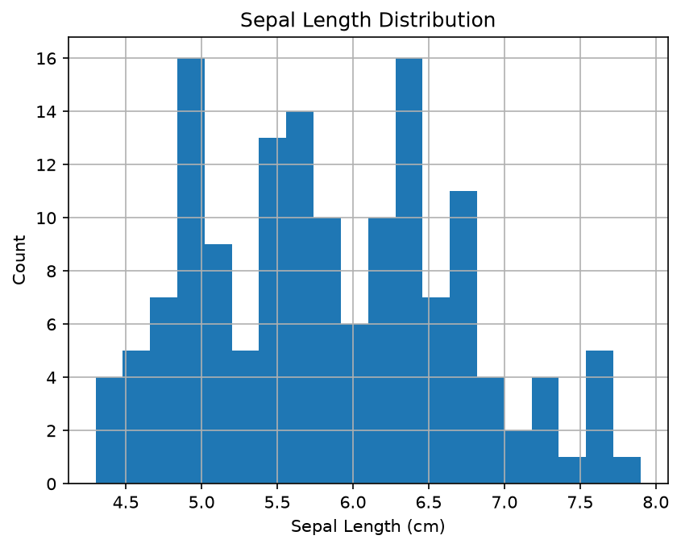
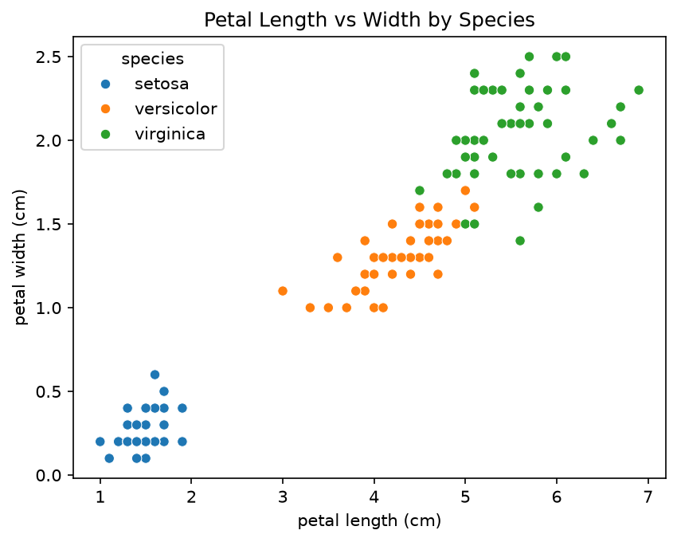

# 🌸 Iris Dataset Analysis

## Overview
Exploratory data analysis of the classic Iris dataset using Python.
150 samples across 3 species: Setosa, Versicolor, and Virginica.

## Libraries Used
| Library | Purpose |
|---|---|
| scikit-learn | Loading the dataset |
| pandas | Data manipulation |
| matplotlib | Plotting |
| seaborn | Statistical visualizations |

## Key Findings
- Petal length and width are the strongest features for separating species
- Setosa is clearly distinct from the other two
- Versicolor and Virginica overlap slightly in petal dimensions

## Visualizations

### Sepal Length Distribution

### Petal Length vs Width by Species
